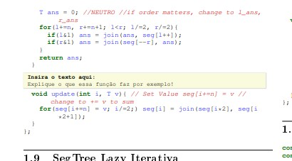
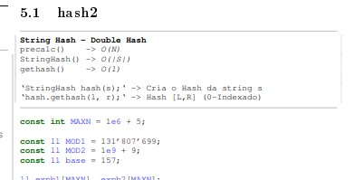

## ↘️  Importando esse Código

Execute esse comando na pasta parent da sua lib, ele vai criar uma pasta pdf com todos os códigos necessários para gerar o arquivo pdf.

```bash
git clone --depth=1 --filter=blob:none --sparse https://github.com/SamuellH12/Competitive-Programming-Algorithms.git temp && cd temp && git sparse-checkout set pdf && cp -r pdf .. && cd .. && rm -rf temp
```

## 📄 Gerar PDF

Para gerar o pdf execute o script shell.

```shell
sh ./generate_pdf.sh
```

Necessário que haja suporte para C++ e [latexmk](https://www.ctan.org/pkg/latexmk/)!

```shell
g++
pdflatex
latexmk 
```

## 📑 Escolher códigos que serão incluídos no PDF 

Para escolher o que entra no pdf ou não, edite o arquivo [contents.txt](contents.txt).

Para remover algum dos códigos do PDF, remova ou comente a linha dele com ```#```.

Para gerar novamente a lista com todos os códigos e extras, rode:
```shell
python3 ./getContents.py > ./contents.txt
```

## 📚 Extras

Você pode criar e adicionar também trechos em latex colocando o arquivo ```.tex``` desejado na pasta [extra](./extra).

Ele irá aparecer no arquivo contents e você também pode controlar o que será ou não adicionado.

Você também pode adicionar seu arquivo tex diretamente na pasta de códigos. Nesse caso recomendo utilizar ```\subsection{NAME_OF_SUBSECTION}``` no início do arquivo.

## 🎈 Personalizações 

**Se você for gerar sua própria Lib**, provavelmente vai querer alterar essas partes dos códigos:

- [generate_latex.cpp](generate_latex.cpp): Tem muitas opções de personalização que você pode ou não querer, veja os detalhes em *"🔧 Outras personalizações"*.

- [getContents.py](getContents.py): Altere ```code_dir = "../Library"``` para o path relativo dos seus códigos. **Lembre de rodar o getContents antes para ter a lista com os seus códigos!** <sup><sub>Confira também o arquivo para ver se todos os códigos que você quer estão lá e para remover coisas que você não quer que entrem.</sub></sup>

- [notebook.tex](notebook.tex): Se quiser mudar a quantidade de colunas, altere ```\begin{multicols*}{3}``` na linha ```119```. Mude também essas opções de títulos do seu PDF e coloque o símbolo da sua universidade.
```tex
\fancyhead[L]{Universidade Federal de Pernambuco - SamuellH12} %line 103
\fancyhead[L]{Universidade Federal de Pernambuco - SamuellH12} %line 108
\title{\vspace{-4ex}\Large{SamuellH12 - ICPC Library}} %line 113
```

- Opcional [generate_pdf.sh](generate_pdf.sh): O pdf gerado está sendo renomeado e movido para a pasta parent da atual. ```mv notebook.pdf ../Notebook.pdf``` (obs: só não mantenha como notebook.pdf)

### :wrench: Outras personalizações

Em [notebook.tex](notebook.tex) você pode personalizar configuraçãos do Latex como cor dos códigos, tamanho das fontes, orientação e tamanho da folha... e tudo mais que possa ser personalizado no Latex.

Edite o arquivo [generate_latex.cpp](generate_latex.cpp) para alterar opções como:

- **Hash**: altere ```bool USE_HASH = true;``` para adicionar ou omitir o hash dos arquivos. Veja mais detalhes na seção Hash.

- **IGNORED_LINES**: ignora **linhas inteiras** com determinados valores de substring (ex: ```#include <bits/stdc++.h>"```, ```"using namespace std;```, ```#define pii pair<int, int>```).Cuidado para não remover algo que você não gostaria que fosse removido.
  
- **IGNORED_SUBSTRINGS**: ignora substrings específicas no código (ex: ```std::```).

- **IGNORED_INTERVAL**: ignora um intervalo do texto, desde a linha que tem ```LATEX_IGNORED_BEGIN``` até a linha com ```LATEX_IGNORED_END``` (inclusivo).

- **Caracteres alterados**: caracteres latinos como à, ã, é, ç, etc... são alterados para a, e, c e etc, para evitar conflitos com o LaTex e caracteres .

- **Descrição**: O código interpreta trechos do arquivo do código como descrição e adiciona essa descrição no pdf em uma caixa logo *antes* do código. Mais especificamente trechos entre comentários específicos: ```/*LATEX_DESC_BEGIN \n Isso é uma descrição! \n LATEX_DESC_END*/```. Para permitir ou não, altere ```bool ADD_DESC = true;```. (cuidado com o IGNORED_LINES, está configurado para ignorar essas linhas). Algumas formatações suportadas (pode ser desabilitado em ```const bool USE_MARKDOWN_IN_DESC = true;```):
  - **bold** com `**bold**`
  - *Itálico* com `_.Italico_.`
  <!-- - `código inline` com ``` `codigo inline` ``` -->
  <!-- - Potência `N^2` e subscrito `x._k` removido por enquanto... -->
  - Escape char `@` para usar LaTex na descrição. Exemplo:
```cpp
/*LATEX_DESC_BEGIN 
    Aqui está um exemplo para adicionar uma imagem na descrição.
    @\begin{center}
        \includegraphics[height=0.3\linewidth]{ascii-art.png}
        \centering\vspace{-3pt}\footnotesize\textit{}
    \end{center}@
LATEX_DESC_END*/
```

- **Descrição em bloco**: Diferente da descrição normal, a descrição em bloco NÃO é movida para o início, mas permanece na mesma posição relativa, como uma caixinha. ```/*BLOCK_DESC_BEGIN Essa é uma descrição de Bloco! BLOCK_DESC_END*/```. Diferente da descrição, a BLOCK_DESC pode ser definida em uma única linha. Aceita formatação "markdown" como a descrição e trechos em LaTex, *mas SEM o uso do Escape char!!!* A cor pode ser alterada em *notebook.tex*.

<p align="center">
  
  
</p>

### 💿 Hash

Gera um código hash hexadecimal de cada linha do código (3 caracteres por padrão). 

Pode ser usado para conferir se o código foi copiado igual ao que está lib. O hash **ignora comentários, espaçamento e identação**. 
Além disso em cada linha que possui um ```}``` terá o hash não somente dessa linha, mas **o hash de todo o contexto** referente, desde a linha do ```{``` que abriu esse contexto. Isto é, de tudo que está entre ```{...}```. Assim você pode conferir funções inteiras mais rapidamente. *Útil para códigos complexos e longos*.

Para conferir o hash na hora da prova, copie este código (já adicionado na lib por padrão se USE_HASH) e em seguida execute 

```shell
g++ hash.cpp -o hash
hash < codigo.cpp
```

```cpp
string getHash(string s){
	ofstream("z.cpp") << s;
	system("g++ -E -P -dD -fpreprocessed ./z.cpp | tr -d '[:space:]' | md5sum > sh");
	ifstream("sh") >> s;
	return s.substr(0, 3);
}

int main(){ 
	string l, t;
	stack<string> st({""});
	while(getline(cin, l)){
		t = l; 
		for(auto c : l)
			if(c == '{') st.push(""); else 
			if(c == '}') t = st.top()+l, st.pop();
		cout << getHash(t) + " " + l << endl;
		st.top() += t;
	}
}
```

<sup><sub>* Inspirado e compatível com o Hash utilizado na Lib [brunomaletta/Biblioteca](https://github.com/brunomaletta/Biblioteca/) </sub></sup>

- Nota: se o compilador reclamar da flag ```-lcrypto```, remova ela e em ```hash/md5hsh.cpp``` remova o ```#define FAST_HASH``` (linha ~40). Nesse caso, calcular o hash dos arquivos será mais lento.

<hr>

Esse código foi inspirado em alguns geradores de lib e latex famosos da comunidade, assim como adicionei novas funcionalidades. Sinta-se livre para copiar e modificar esse código também. =]

## 🦕🦖
